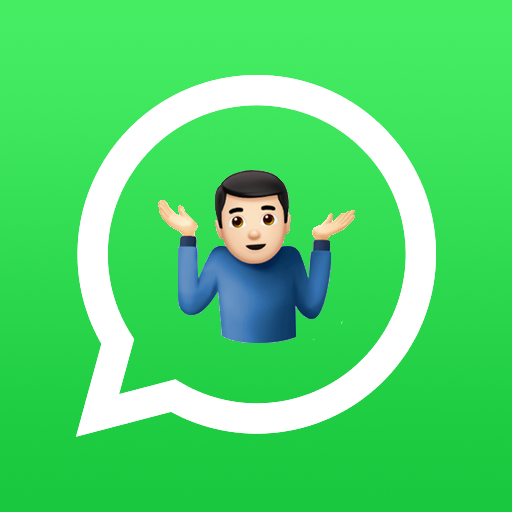

# Why Save - Android App  

"Why Save" lets you access WhatsApp chats without saving phone numbers. Just select or input phone numbers to instantly open desired chats. The app also logs opened chats for a communication history and allows users to add personal notes for each number.

Why Save is available on the Google Play Store.

  

## Salient Features

The android app lets you:
- Select a phone number anywhere in your phone and ‘Why Save’ option appears which takes you straight to the WhatsApp chat without saving the number in contact list.
- Type the phone number in the ‘Why Save’ app and it will take you to the WhatsApp chat directly.
- ‘Why Save’ maintains the history of chats opened via ‘Why save’ and you can check the logs of how often those chats were opened.
- You can add a note for the number in why save so that you’re aware why you contacted that particular number.

## Screenshots

                   

## Contributing
why-save app is a free and open source project developed by myself currently. Any contributions are welcome. Here are a few ways you can help:
 * [Report bugs and make suggestions.](https://github.com/wallabag/android-app/issues)
 * [Criticise me directly.](mailto:contact@rachitbhutani.com?subject=Feedback%20for%20Why%20Save)
 * Write some code. Please follow the code style used in the project to make a review process faster.